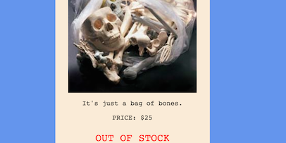

# Express Store
<p align="center"></p>


## Introduction
This is a three-part deliverable for which you will be given plenty of class time to complete! Make sure you spend your time on this project, and keep it to professional standards and appearance. Ideally this is something you are able to include in your Project 1 portfolio and can show off to recruiters, hiring managaers, and other engineers.


## Background
After your pokedex commissions, you've started to get more requests from various clients! Currently, you have been commissioned to create an e-commerce store for a company. They need you to build a website and database that allows users to browse products, add items to a cart, and leave reviews.

You will implement this site using Express, Mongoose, EJS, and CSS or SASS.


## Submission Instructions
- Fork and clone this repository
- In the repository folder on your computer, create a folder called `express-store`.
- Scaffold a MEN-stack app inside the `express-store` folder. You'll be working in this folder for each of the three parts.
- Commit early and commit often
- When you have finished a part create a commit message like this:
    ```
    Part 1 complete - ready to be graded
    ```
- We will be grading each part as it's own deliverable! Make sure you complete each part before moving on to the next


## General Requirements (applicable to all parts)
- Implement EJS partials for resuable elements such as a navigation menu, or a footer.
- Ensure each page of your website is reponsive to the screen it is displayed on.
- Follow MVC architecture and observe a separation of concerns.
- Maintain consistent CSS styling throughout the site. Using a CSS framework may be beneficial for this.
- Provide a link to any resources from which you obtained code, and be able to explain the purpose of all the code within your application.

### Style Inspiration 
See some previous student's examples for some inspiration for your store.

<details><summary><strong>NeoBoutique</strong></summary>

</details>

<details><summary><strong>flow.hack</strong></summary>

</details>


## Part 1 - Index, Show, and Seed Routes
### Planning
- Create a route table that explains lays out the REST, HTTP, and CRUD actions of each route in your application.
- Wireframe each page.
- Create a `README` inside the `express-store` folder that contains your route table and wireframes.

### Set Up
- Create all the folders and files you will need.
- Set up you MongoDB connection and Mongoose schema.
    - Your `product` schema must include the following properties.
        1. Name
        1. Description
        1. Rating
        1. Price
        1. Quantity
    - You are welcome to add any additional properties that you would like to this schema.
- Create your seed data.


### Index Route
- Create the landing page of the website that displays all the products in the store.
- Each product will link to its own details page (show route)


### Show Route
- Create a reusable page that dynamically renders all the information about a product.
- If a product has a `0` value in the `quantity` field, display text that says **OUT OF STOCK**

    

    - **HINT**: Look up conditional rendering in EJS using `if..else` statements or ternary operators

- Must contain a link back to the index route.


### Seed Route
- Create a route that will eliminate all the products in your database and then re-populate it with your seed data.


## Part 2 - All Other RESTful Routes
### New & Create Routes
- Create a link to a New Product form on the home page of your store.
- When submitted, the New Product form will create a new product in the database and redirect the user to the new product's show page.
    - Ensure your form aligns with your product schema specifications
    - If your schema calls for default values, consider how you would set defaults in your inputs.
    - **HINT:** The inputs must have a `name` attribute that matches the respective property in your schema.


### Edit & Update Routes
- Create a link to a New Product form on the show page of each product.
- When submitted, the New Product form will create a new product in the database and redirect the user to the updated product's show page.
    - Ensure your form aligns with your product schema specifications
    - Pre-populate your form with the product data
- Create a purchase button on the show page of each product. When pressed, it will decrement the quantity of the product in the database.
    - **HINT:** Browse the MongoDB and Mongo documentation. What atomic operator could be useful for this?


### Delete Route
- Create a delete button on the show page of each product. When pressed, it will remove the product from the database and redirect the user to the home page.


## Extra Hints
<details>
<summary><strong>Purchase Button</strong></summary>

Check out the [`$inc` operator](https://www.mongodb.com/docs/manual/reference/operator/update/inc/)
</details>

<details>
<summary><strong>Delete Route</strong></summary>

Remember to wrap the delete button in a `<form>` element and use `method-override`
</details>


## Bonus
- Include a search bar on the index route that will allow users to search for items.
- Create an additional route for an `About` page.
- Organize products by category. Create logic that will allow users to naviagte to specific routes that display only products in a given category.